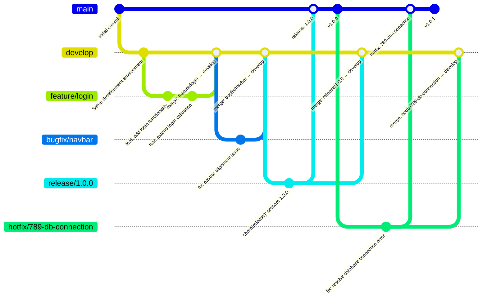

# D2: Branching Strategie und Semantic Versioning

## Branching Strategie

### Zielsetzung

Die Branching Strategie dient der strukturierten Zusammenarbeit im Team sowie der Qualitätssicherung des Codes. Sie definiert, wie neue Features, Bugfixes und Releases entwickelt, getestet und in die Hauptentwicklung integriert werden.

### Wahl der Strategie

Wir setzen eine **vereinfachte GitFlow-Strategie** ein, da diese für kleine bis mittlere Projekte geeignet ist. Sie ermöglicht uns:

- **Stabilität:** Strikte Trennung zwischen produktivem Code (`main`) und laufender Entwicklung (`develop`).
- **Parallelität:** Mehrere Entwickler können gleichzeitig an Features arbeiten, ohne sich gegenseitig zu blockieren.
- **Qualitätssicherung:** Jede Code-Änderung wird über einen Pull Request geprüft und durchläuft automatisierte Tests (CI-Pipeline).

### Branch-Typen und Verwendungszweck

| Branch-Typ   | Zweck                                                                                                    | Basis-Branch | Ziel-Branch    | Namenskonvention     |
| ------------ | -------------------------------------------------------------------------------------------------------- | ------------ | -------------- | -------------------- |
| **main**     | Enthält ausschliesslich produktiven, getesteten und freigegebenen Code. Jeder Commit ist ein Release-Tag. | -            | -              | `main`               |
| **develop**  | Integrations-Branch für alle neuen Entwicklungen. Bildet den Stand des nächsten Releases ab.             | `main`       | -              | `develop`            |
| **feature/** | Entwicklung eines neuen Features.                                                                        | `develop`    | `develop`      | `feature/<feature>`  |
| **bugfix/**  | Behebung eines Fehlers, der nicht produktiv ist.                                                         | `develop`    | `develop`      | `bugfix/<ticket-id>` |
| **release/** | Vorbereitung auf ein Release (finale Tests, Versionsanpassungen, Doku).                                  | `develop`    | `main,develop` | `release/<version>`  |
| **hotfix/**  | Kritische Fehlerbehebung direkt in der Produktion.                                                       | `main`       | `main,develop` | `hotfix/<ticket-id>` |

#### Haupt-Branches

- **main**: Heilig – keine direkten Commits. Aktualisierung nur durch `release/*` oder `hotfix/*`.  
  Jeder Merge auf `main` erzeugt einen neuen Versions-Tag.

- **develop**: Puls des Projekts – hier laufen alle `feature/*` und `bugfix/*` zusammen.  
  Der Code ist stabil, aber noch nicht zwingend „feature-complete“.

#### Arbeits-Branches

- **feature/**: Für jede neue Funktion ein eigener Branch (z.B. `feature/user-authentication`).
- **bugfix/**: Für die Behebung von Fehlern, die noch nicht in Produktion sind.
- **release/**: Wird erstellt, wenn `develop` alle Features für das nächste Release enthält.  
  Enthält nur noch Bugfixes, Versionsanpassungen und Dokumentation. Keine neuen Features.
- **hotfix/**: Für kritische Produktionsfehler, die sofort behoben werden müssen.

### Erlaubte Merge-Wege

- `feature/*` → **merge** nach `develop` (via Pull Request, mit Code Review).
- `bugfix/*` → **merge** nach `develop` (via Pull Request).
- `hotfix/*` → **merge** nach `main` **und** zurück nach `develop`.
- `release/*` → **merge** nach `main` **und** zurück nach `develop`.

### Workflow: Pull Requests als Quality Gate

Jede Änderung erfolgt ausschließlich über Pull Requests:

1. Erstellung eines PRs vom Arbeits-Branch in den Ziel-Branch.
2. Review durch mindestens ein Teammitglied (Logik, Stil, mögliche Fehler).
3. Automatisierte Tests und Linting über die CI-Pipeline.
4. Diskussion und Einarbeitung von Feedback im PR.
5. Merge nur nach Freigabe und erfolgreichen Checks.

So stellen wir sicher, dass jede Code-Zeile von mindestens vier Augen geprüft wird.

### Visualisierung

Die folgende Grafik zeigt den vereinfachten Workflow. Sie erklärt, wie neue Features, Bugfixes, Releases und Hotfixes in verschiedenen Branches entwickelt und dann in die Hauptzweige integriert werden:

### Semantic Versioning (SemVer)

Wir verwenden **MAJOR.MINOR.PATCH** (z.B. `2.5.1`):

- **MAJOR**: Inkompatible Änderungen (z.B. API-Bruch, grosse Architekturänderung).
- **MINOR**: Neue Features, die abwärtskompatibel sind.
- **PATCH**: Fehlerbehebungen oder kleine Anpassungen ohne Auswirkungen auf Schnittstellen.

#### Zusammenhang mit der Branching-Strategie

- Ein `release/*` Branch führt meist zu einer **MINOR-Version**, z.B. `release/1.2.0`.
- Nach Abschluss wird ein **Tag** auf `main` gesetzt: `v1.2.0`.
- Ein `hotfix/*` Branch führt immer zu einer **PATCH-Version**, z.B. `v1.2.1`.

#### Anwendungsbeispiele

- Erstes Release: `v1.0.0`  
  → Branch: `release/1.0.0`, Merge nach `main`.

- Neues Feature im Login-Modul: `v1.1.0`  
  → Entwicklung auf `feature/login`, Merge in `develop`, Release mit `release/1.1.0`.

- Kritischer Produktionsbug: `v1.1.1`  
  → Entwicklung auf `hotfix/789-db-connection`, Merge nach `main` und `develop`.
