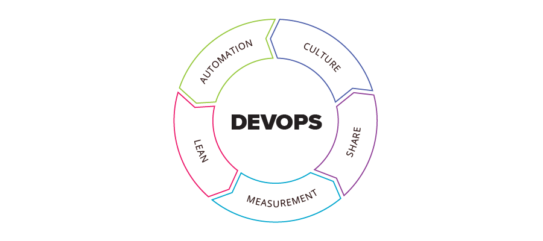

# CALMS-Modell – Zusammenfassung

Das **CALMS-Modell** ist ein Rahmenwerk, das die Leitprinzipien von **DevOps** beschreibt.  
Es steht für **Culture, Automation, Lean, Measurement, Sharing**.  
Manchmal findet man auch nur **CAMS**, da _Lean_ als optional betrachtet wird.

---

## C – Culture (Kultur)

- Zusammenarbeit zwischen Dev und Ops statt Silo-Denken.
- Gemeinsame Verantwortung für Qualität und Stabilität.
- Fehler werden akzeptiert und als Lernchance gesehen.
- Fundament jeder erfolgreichen DevOps-Transformation.

---

## A – Automation (Automatisierung)

- Automatisierte Tests, Builds, Deployments, Monitoring.
- CI/CD-Pipelines zur schnellen und zuverlässigen Auslieferung.
- Ziel: Weniger manuelle Fehler, mehr Geschwindigkeit.
- Aber: DevOps ≠ nur Automatisierung!

---

## L – Lean

- Ursprung: Toyota-Produktionssystem.
- Fokus auf **Wert für den Kunden** und **Eliminierung von Verschwendung (Waste)**.
- Kontinuierliche Verbesserung und kurze Feedbackzyklen.
- Mut zu Experimenten und Lernen durch direkte Erfahrung.

---

## M – Measurement (Messen)

- Entscheidungen basieren auf Daten statt Bauchgefühl.
- Typische Metriken:
  - **Lead Time** (Zeit von Commit bis Produktion)
  - **Deployment-Frequenz**
  - **MTTR** (Mean Time to Recovery)
  - **Change Failure Rate**
- Unterscheidung zwischen Prozess-, Betriebs- und Businessmetriken.

---

## S – Sharing (Teilen)

- Wissen und Erfahrungen aktiv weitergeben (Wikis, Post-Mortems, Brown-Bag-Sessions).
- Offener Umgang mit Fehlern – keine Schuldzuweisungen.
- Fördert Vertrauen, Zusammenarbeit und eine Lernkultur.

---

## Fazit

- CALMS ist **eine Leitlinie**, kein Messinstrument.
- Es verdeutlicht, dass DevOps nicht nur Technik ist, sondern ebenso Kultur, Lernen und Zusammenarbeit.
- Erfolg wird mit **konkreten Kennzahlen** (z. B. DORA-Metriken) gemessen.
