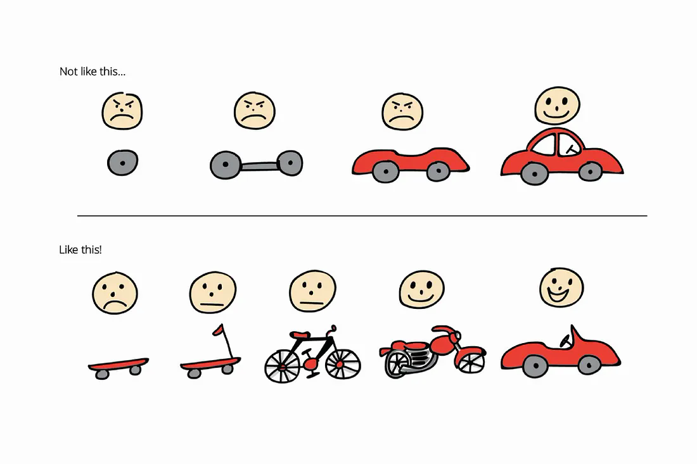

# DevOps-Prozess

## SDLC vs. DevOps Lifecycle

**SDLC**: Linear, phasenorientiert (Analyse → Design → Implementation → Testing → Deployment → Wartung)

**DevOps**: Kontinuierlicher Kreislauf (Planning → Coding → Build → Testing → Release → Deploy → Operate → Monitor)

## Hauptunterschiede

| SDLC                     | DevOps                      |
| ------------------------ | --------------------------- |
| Getrennte Abteilungen    | Cross-funktionale Teams     |
| Grosse, seltene Releases | Kleine, häufige Deployments |
| Spätes Feedback          | Kontinuierliches Feedback   |
| Linear                   | Zyklisch                    |

## MVP (Minimum Viable Product)

**Definition**: Produkt mit minimalem, aber wertvollem Funktionsumfang für erstes Nutzerfeedback.

**Im DevOps**: Schnelle Integration, kontinuierliche Verbesserung durch Feedback-Schleifen.

**Wichtig**: MVP soll sofort Nutzen bieten (Skateboard → Fahrrad → Auto), nicht nur unvollständige Teile.

## Vorteile des DevOps-Prozesses

- **Flexiblere, schnellere Auslieferung**
- **Geringere Fehlerquoten** durch frühes und fortlaufendes Testen
- **Bessere Skalierbarkeit** und schnellere Marktanpassungen
- **Kontinuierliche Verbesserung** durch direktes Feedback

## MVP (Minimum Viable Product) im DevOps Lifecycle

Das **MVP-Konzept** ist perfekt in den DevOps-Prozess integriert:

### Was ist ein MVP?

- **Produkt mit minimalem, aber wertvollem Funktionsumfang**
- Ziel: Erste Nutzerreaktionen und Feedback erhalten
- **Kernmerkmale**: Essenzielle Funktionen, schnell realisierbar, fokussiert auf Lernen

### MVP im DevOps Lifecycle

- **Frühe Integration**: MVP wird schnell in den kontinuierlichen Prozess eingebracht
- **Kontinuierliche Verbesserung**: DevOps-Prinzipien ermöglichen schnelle Iterationen
- **Feedback-Integration**: Monitoring und Nutzerfeedback fliessen direkt in neue Zyklen ein
- **Innovation**: Fördert nutzerzentrierte Entwicklung

**Wichtiger Grundsatz**: Ein MVP sollte nicht nur ein unvollständiger Teil des Endprodukts sein, sondern **bereits von Anfang an echten Nutzen bieten**. Statt ein Auto schrittweise zu entwickeln, wird der Nutzen "Fortbewegung" direkt geliefert und kontinuierlich verbessert.

## Fazit

Der **DevOps-Prozess** revolutioniert die Softwareentwicklung durch:

- **Kontinuierliche Integration** von Entwicklung und Betrieb
- **Schnellere, zuverlässigere Auslieferung** durch Automatisierung
- **Frühes Feedback** und kontinuierliche Verbesserung
- **MVP-Integration** für nutzerzentrierte Entwicklung

Diese Transformation ermöglicht es Unternehmen, **agiler, reaktionsfähiger und kundenorientierter** zu werden.

### Quellen

- [GeeksforGeeks – DevOps Lifecycle](https://www.geeksforgeeks.org/devops/devops-lifecycle/)
- [AWS – Was ist SDLC?](https://aws.amazon.com/de/what-is/sdlc/)
- [Atlassian – DevOps](https://www.atlassian.com/de/devops)
- [BrowserStack – DevOps Lifecycle](https://www.browserstack.com/guide/devops-lifecycle)
- [Medium – What is Minimum Viable Data Product?](https://medium.com/idealo-tech-blog/what-is-minimum-viable-data-product-49269e338d85)
