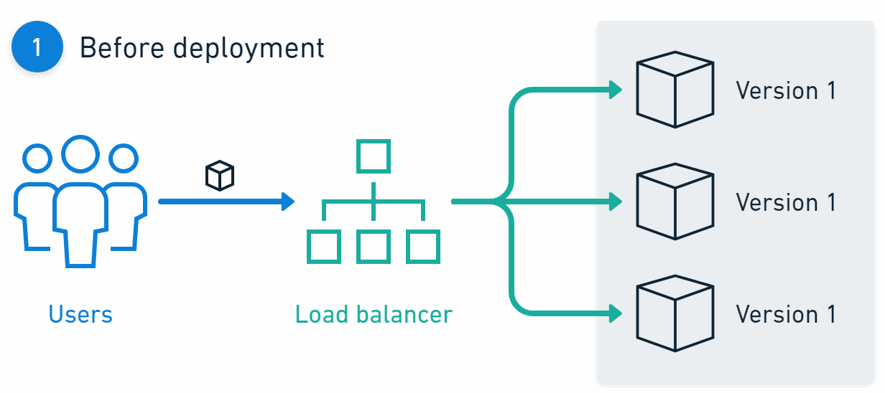
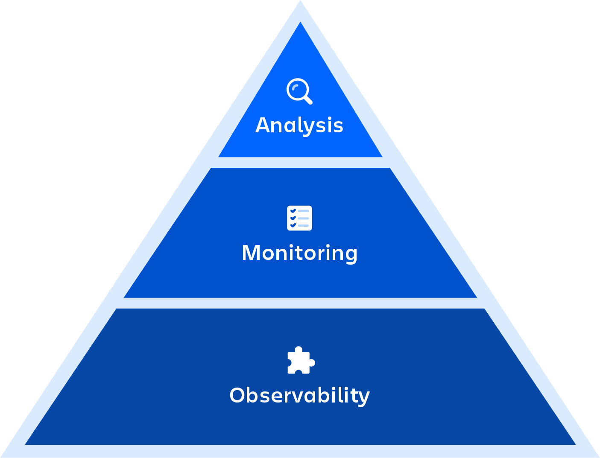

# Continuous Deployment

Continuous Deployment ist eine Software-Release-Praxis, bei der jede Code-Änderung, die automatisierte Tests besteht, automatisch in die Produktionsumgebung released wird. Nachdem ein Entwickler Code committet, baut, testet und deployt ein automatisiertes System diesen ohne manuelle Eingriffe. Ein fehlgeschlagener Test ist das Einzige, was verhindert, dass eine neue Änderung an die User deployed wird. Dieser Prozess erweitert Continuous Integration, welche das häufige Mergen und Testen von Code umfasst, und Continuous Delivery, welche sicherstellt, dass jede Änderung jederzeit in einem releasefähigen Zustand ist.

Quelle: [Atlassian – DevOps Monitoring](https://www.atlassian.com/devops/devops-tools/devops-monitoring)

Die Implementierung von Continuous Deployment basiert auf einer CI/CD-Pipeline, einer Reihe von automatisierten Schritten. Tools wie Jenkins, GitLab CI oder GitHub Actions automatisieren die Build-, Integrations- und Testphasen. Wenn alle Stufen erfolgreich durchlaufen werden, löst die Pipeline automatisch Deployment-Skripte aus, die den Code in die Produktionsumgebung releasen. Dieser Prozess erfordert eine umfangreiche Automatisierung im Testing und im Infrastruktur-Management, um sicherzustellen, dass jeder Release die Qualität und Stabilität beibehält. Teams verwenden häufig Techniken wie Feature Flags, um die Verfügbarkeit neuer Funktionalitäten zu steuern, und Continuous Monitoring, um Probleme in der Produktion zu erkennen.

# Continuous Delivery vs. Continuous Deployment

Continuous Delivery und Continuous Deployment sind verwandte Praktiken, die Software-Releases automatisieren, sich jedoch im letzten Deployment-Schritt unterscheiden. Bei Continuous Delivery wird jede Code-Änderung automatisch gebaut, getestet und für den Release in die Produktion vorbereitet. Das finale Deployment an die User ist jedoch ein manueller Schritt, der durch eine geschäftliche oder operative Entscheidung ausgelöst wird. Dies stellt ein manuelles Approval Gate vor dem Release dar.

Continuous Deployment automatisiert diesen letzten Schritt. Jede Änderung, die alle automatisierten Tests in der Pipeline erfolgreich besteht, wird automatisch in die Produktion deployed.

Die folgende Tabelle vergleicht die beiden Praktiken.

Quelle: [Atlassian – Continuous Delivery](https://www.atlassian.com/continuous-delivery/principles/continuous-integration-vs-delivery-vs-deployment)

| Merkmal                      | Continuous Delivery                                                                                     | Continuous Deployment                                                                           |
| ---------------------------- | ------------------------------------------------------------------------------------------------------- | ----------------------------------------------------------------------------------------------- |
| **Finales Deployment**       | Manuell; wird durch eine menschliche Entscheidung ausgelöst.                                            | Automatisch; erfolgt nach dem Bestehen aller automatisierten Tests.                             |
| **Menschliche Intervention** | Beinhaltet einen manuellen Genehmigungsschritt vor dem Production-Release.                              | Keine menschliche Intervention nach dem initialen Code-Commit erforderlich.                     |
| **Release-Prinzip**          | Die Software ist jederzeit _bereit_, deployed zu werden.                                                | Die Software wird _kontinuierlich_ und nahezu in Echtzeit deployed.                             |
| **Wichtigster Trade-off**    | Priorisiert Kontrolle und auf Geschäftszeiten abgestimmte Releases gegenüber maximaler Geschwindigkeit. | Priorisiert Geschwindigkeit und eine schnelle Feedback-Loop gegenüber manueller Kontrolle.      |
| **Eignung für Use Cases**    | Umgebungen mit regulatorischen Anforderungen, festen Release-Zyklen oder High-Stakes-Änderungen.        | Umgebungen mit hohem Vertrauen in automatisierte Tests und dem Bedarf an schnellen Iterationen. |

## Vor- und Nachteile von Continuous Delivery und Deployment

### Continuous Delivery

- **Vorteile:**

  - **Reduziertes Risiko:** Durch die Pflege einer jederzeit deploybaren Codebase und den Einsatz rigoroser automatisierter Tests senkt Continuous Delivery das Risiko, dass Bugs in die Produktion gelangen.
  - **Verbesserte Entwicklerproduktivität:** Entwickler erhalten schnelleres Feedback, und die Routine des Prozesses verbessert die Zusammenarbeit zwischen Entwicklungs- und Betriebsteams.
  - **Geschäftliche Flexibilität:** Das manuelle Approval Gate ermöglicht es Teams, Releases auf Geschäftszeiten abzustimmen und bietet eine Gelegenheit für eine finale Qualitätssicherung und ein Review durch Stakeholder.

- **Nachteile:**

  - **Geringere Release-Geschwindigkeit:** Der manuelle Genehmigungsschritt bedeutet, dass Deployments nicht sofort erfolgen und zu einem Bottleneck werden können, insbesondere wenn sich Genehmigungen verzögern.
  - **Potenzial für Verzögerungen:** Der menschliche Faktor im finalen Deployment-Schritt kann zu Verzögerungen führen, die durch vollständige Automatisierung eliminiert würden.
  - **Risiko von gebündelten Änderungen (Batched Changes):** Wenn das manuelle Gate nicht effizient verwaltet wird, können Teams dazu neigen, mehrere Änderungen in einem einzigen Release zu bündeln, was die Effektivität der Praxis verringert.

### Continuous Deployment

- **Vorteile:**

  - **Beschleunigtes Time-to-Market:** Features und Fixes werden den Usern nur Minuten nach dem Mergen bereitgestellt, was die schnellstmögliche Feedback-Loop ermöglicht.
  - **Gesteigerte Effizienz:** Der vollständig automatisierte Prozess eliminiert den Stress eines "Release Day", und Engineers können die Auswirkungen ihrer Arbeit fast sofort in der Produktion sehen.
  - **Verbesserte Qualität über die Zeit:** Durch das Releasen kleiner, inkrementeller Änderungen können Teams Probleme schneller identifizieren und beheben, was langfristig zu einem stabileren Produkt führt.

- **Nachteile:**

  - **Höheres Risiko von Produktionsproblemen:** Jeder Bug, der von der automatisierten Test-Suite nicht gefunden wird, wird direkt an die User deployed, was das Risiko bei jedem Release erhöht.
  - **Erfordert hohe Reife:** Diese Praxis eignet sich in der Regel nur für Teams mit einer reifen DevOps-Kultur, einem gut getesteten System und hohem Vertrauen in ihre automatisierten Tests und ihr Monitoring.
  - **Ungeeignet für bestimmte Branchen:** Unternehmen in regulierten Branchen oder solche mit strengen User-Acceptance-Fenstern könnten das Risiko von Continuous Deployment aufgrund des fehlenden finalen manuellen Checks als inakzeptabel empfinden.

# Deployment-Strategien

Deployment-Strategien werden verwendet, um neue Softwareversionen zu releasen und dabei Risiken und Downtime zu minimieren. Gängige Strategien sind das Blue/Green-Deployment und das Canary-Deployment.

## Blue/Green-Deployment

Quelle: [Octopus Deploy – Blue/Green Deployments](https://octopus.com/devops/software-deployments/blue-green-deployment/)

Blue/Green-Deployment ist eine Release-Strategie, die Downtime reduziert, indem zwei identische Produktionsumgebungen, "Blue" und "Green" genannt, betrieben werden. Zu jedem Zeitpunkt ist nur eine Umgebung live und bedient den gesamten Produktions-Traffic. Für einen neuen Release wird das Update in der inaktiven Umgebung (z. B. Green) deployed. Nachdem die neue Version in der Green-Umgebung getestet wurde, wird der Anwendungs-Traffic von der Blue- auf die Green-Umgebung umgeleitet. Die Green-Umgebung wird dann zur aktiven Produktionsumgebung, und die Blue-Umgebung wird inaktiv.

Diese Technik ermöglicht ein Deployment mit nahezu keiner Downtime. Ein Rollback wird erreicht, indem der Traffic zurück auf die vorherige Version (Blue) geleitet wird, die noch immer läuft. Die grösste Herausforderung dieses Ansatzes sind die Ressourcenkosten und die Komplexität der Wartung von zwei vollständigen Produktionsumgebungen.

## Canary-Deployment

Quelle: [Octopus Deploy – Canary Deployments](https://octopus.com/devops/software-deployments/canary-deployment/)

Canary-Deployment ist eine Strategie, bei der eine neue Softwareversion schrittweise für eine kleine Untergruppe von Usern oder Servern (Subset) freigegeben wird, bevor sie der gesamten User-Basis zur Verfügung gestellt wird. Der Begriff leitet sich von der Praxis des "Kanarienvogels im Kohlebergwerk" ab, bei der die kleine User-Gruppe als Frühwarnsystem für potenzielle Probleme dient.

Der Prozess umfasst das Deployment der neuen Version auf einem kleinen Teil der Produktionsinfrastruktur (dem "Canary"). Das Team überwacht für diese Gruppe wichtige Metriken wie Fehlerraten und Performance. Wenn keine Probleme festgestellt werden, wird die neue Version inkrementell auf einen grösseren Teil der Infrastruktur ausgerollt, bis das Deployment abgeschlossen ist. Tritt ein Problem auf, wird das Deployment gestoppt oder zurückgerollt (Rollback), was nur das kleine Subset von Usern betrifft. Diese Strategie reduziert das Risiko, einen Bug für alle User gleichzeitig einzuführen, und liefert reale Leistungsdaten. Sie erhöht jedoch die Komplexität des Traffic-Managements und erfordert ein robustes Monitoring.

| Aspekt                   | Blue/Green-Deployment                                                       | Canary-Deployment                                                                             |
| ------------------------ | --------------------------------------------------------------------------- | --------------------------------------------------------------------------------------------- |
| **Rollout-Prozess**      | Schaltet 100% des Traffics auf einmal auf die neue Umgebung um.             | Verlagert den Traffic schrittweise auf die neue Version, beginnend mit einem kleinen Subset.  |
| **Risikoexposition**     | Geringes Downtime-Risiko, aber Bugs betreffen nach dem Switch alle User.    | Begrenzt; Probleme betreffen nur die anfänglich kleine User-Gruppe.                           |
| **Infrastrukturkosten**  | Hoch; erfordert die Wartung von zwei vollständigen Produktionsumgebungen.   | Geringer; in der Regel laufen beide Versionen auf der bestehenden Infrastruktur.              |
| **Rollback-Mechanismus** | Einfach und schnell; leitet den Traffic zurück auf die alte Umgebung.       | Erfordert das Umleiten des Traffics und potenziell ein erneutes Deployment der alten Version. |
| **Echtwelt-Feedback**    | Beschränkt auf das Post-Release-Monitoring der gesamten User-Basis.         | Liefert Performance- und Nutzungsdaten von einem Live-Subset vor einem vollständigen Rollout. |
| **Komplexität**          | Hauptsächlich im Management der Umgebungen und der Datenbankkompatibilität. | Hauptsächlich im Traffic-Routing, der Versionskompatibilität und im Monitoring.               |

# A/B-Testing

A/B-Testing, auch als Split-Testing bekannt, ist eine experimentelle Methode, bei der zwei oder mehr Versionen eines Features verglichen werden, um zu bestimmen, welche im Hinblick auf eine bestimmte Metrik besser abschneidet. Bei einem A/B-Test wird die User-Basis in Gruppen aufgeteilt, wobei jeder Gruppe eine andere Version gezeigt wird (z. B. Version A als Kontrolle, Version B als Variante). Produktteams sammeln Daten über User-Interaktionen, wie Click-Through-Rates oder Conversion-Rates, um datengestützte Entscheidungen darüber zu treffen, welche Version implementiert werden soll.

Obwohl A/B-Testing ähnliche Traffic-Splitting-Mechanismen wie Canary-Deployments verwendet, ist der Zweck ein anderer. Canary-Deployments werden eingesetzt, um die Stabilität und Performance eines neuen Releases zu validieren, während A/B-Testing ein Experiment ist, um das Verhalten und die Präferenzen der User zu messen.

# Feature Toggles

Ein Feature Toggle, oder Feature Flag, ist eine Technik, die es Teams ermöglicht, das Systemverhalten ohne Code-Änderungen zu modifizieren. Ein Feature Flag ist eine Bedingung im Code, die Funktionalität zur Laufzeit (Runtime) aktiviert oder deaktiviert. Dies erlaubt Entwicklern, neue Features in einem deaktivierten Zustand in die Produktion zu deployen und sie später zu aktivieren.

Feature Toggles unterstützen mehrere Praktiken im Continuous Deployment:

- **Entkopplung von Deployment und Release:** Code kann sicher in die Produktion deployed werden, während das zugehörige Feature für die User verborgen bleibt, bis es für den Release bereit ist.
- **Schrittweise Rollouts:** Features können für einen kleinen Prozentsatz der User aktiviert werden, ähnlich einem Canary-Release, und schrittweise für ein breiteres Publikum ausgerollt werden.
- **Kill-Switches:** Wenn ein neu releastes Feature Probleme verursacht, kann es sofort durch das Ausschalten des Flags deaktiviert werden. Dies dient als schneller Rollback-Mechanismus, ohne ein erneutes Deployment zu erfordern.

# Rollback-Strategien

Eine Rollback-Strategie ist ein Plan, um ein Deployment auf einen früheren stabilen Zustand zurückzusetzen, falls der neue Release kritische Probleme verursacht. Je nach Deployment-Methode und Architektur stehen verschiedene Strategien zur Verfügung.

- **Vollständiger Rollback (Full Rollback):** Dies beinhaltet das erneute Deployment der letzten bekannten stabilen Version des Anwendungsartefakts, wodurch das gesamte Deployment rückgängig gemacht wird. Dies ist unkompliziert, kann aber auch nicht zusammenhängende Fixes zurücksetzen, die im fehlerhaften Release enthalten waren.
- **Teilweiser Rollback (Partial Rollback):** In einer Microservices-Architektur wird nur der spezifische Service, der fehlschlägt, auf seine vorherige Version zurückgesetzt, während andere aktualisierte Services bestehen bleiben. Dies erfordert ein sorgfältiges Management von Abhängigkeiten und Kompatibilität zwischen den Services.
- **Rollback per Feature Flag:** Wenn ein Feature mithilfe eines Feature Toggles releast wird, kann ein Rollback einfach durch das Ausschalten des Flags durchgeführt werden. Dies ist eine der schnellsten Rollback-Methoden, da es sich um eine Konfigurationsänderung und nicht um ein neues Deployment handelt.
- **Blue/Green-Rollback:** Bei einem Blue/Green-Deployment besteht ein Rollback darin, den Traffic zurück auf die alte Umgebung umzuleiten, in der noch die vorherige stabile Version läuft. Dieser Prozess ist in der Regel sehr schnell.

# Continuous Monitoring

Quelle: [Atlassian – DevOps Monitoring](https://www.atlassian.com/devops/devops-tools/devops-monitoring)

Continuous Monitoring ist die Praxis der Echtzeit-Überwachung von Zustand (Health), Performance und Sicherheit von Anwendungen und Infrastruktur während des gesamten Softwareentwicklungszyklus (Lifecycle). Es liefert Feedback darüber, wie sich Code-Änderungen in der Produktion verhalten, was in einer Continuous-Deployment-Umgebung unerlässlich ist.

Die Implementierung umfasst eine Kombination aus Tools und Praktiken:

- **Application Performance Monitoring (APM):** Verfolgt Metriken wie Antwortzeiten, Fehlerraten und Transaktionsdurchsatz. Zu den Tools gehören New Relic und Datadog.
- **Infrastruktur-Monitoring:** Verfolgt Server-Metriken wie CPU-, Speicher- und Festplattenauslastung. Zu den Tools gehören Prometheus und Grafana.
- **Log-Management:** Sammelt und analysiert Logs von allen Anwendungen und Systemen, um Fehlermuster zu identifizieren. Zu den Tools gehören der ELK Stack (Elasticsearch, Logstash, Kibana) und Splunk.
- **Alerting:** Benachrichtigt Teams automatisch über Probleme, wenn bestimmte Schwellenwerte überschritten oder Anomalien erkannt werden.

# Sichere Passwortspeicherung

Passwörter sollten niemals im Klartext oder in einem reversibel verschlüsselten Format gespeichert werden. Die branchenübliche Praxis ist die Speicherung eines kryptografischen Hashes des Benutzerpassworts. Eine Hash-Funktion ist ein Einweg-Algorithmus, der ein Passwort in eine Zeichenkette fester Länge umwandelt. Es ist rechnerisch unmöglich, den Prozess umzukehren und das ursprüngliche Passwort aus dem Hash abzuleiten.

Für die Passwortspeicherung müssen Hash-Funktionen langsam und rechenintensiv sein, um Brute-Force-Angriffen standzuhalten. Algorithmen wie MD5 und SHA-1 gelten für diesen Zweck als unsicher, da sie zu schnell sind. Stattdessen sollten dedizierte Algorithmen zum Passwort-Hashing verwendet werden:

- **bcrypt:** Ein weit verbreiteter Algorithmus, der einen Work Factor (Cost) einbezieht, um den Hashing-Prozess zu verlangsamen.
- **scrypt:** Entwickelt, um speicherintensiv (memory-hard) zu sein, was ihn widerstandsfähiger gegen hardwarebasierte Angriffe als bcrypt macht.
- **Argon2:** Der Gewinner der Password Hashing Competition 2015, gilt als State-of-the-Art-Wahl. Er ist darauf ausgelegt, resistent gegen GPU-Cracking und andere parallele Rechenangriffe zu sein.

Eine weitere entscheidende Praxis ist das **Salting**. Ein Salt ist ein einzigartiger, zufällig generierter Wert, der jedem Passwort vor dem Hashing hinzugefügt wird. Der Salt wird zusammen mit dem Hash gespeichert. Salting stellt sicher, dass zwei identische Passwörter unterschiedliche Hashes haben, was Angreifer daran hindert, vorberechnete Rainbow-Tables zu verwenden, um mehrere Passwörter auf einmal zu knacken.

# Arten von Deployment-Ansätzen

Es gibt verschiedene Ansätze für das Deployment von Software, die jeweils eine spezifische Umgebung und Tooling erfordern. Die Wahl des Ansatzes hängt von Faktoren wie Anwendungsarchitektur, Skalierbarkeitsanforderungen und Team-Expertise ab.

| Deployment-Ansatz                      | Beschreibung                                                                                                                                                                             | Benötigte Software/Umgebung                                                                                                                                           |
| -------------------------------------- | ---------------------------------------------------------------------------------------------------------------------------------------------------------------------------------------- | --------------------------------------------------------------------------------------------------------------------------------------------------------------------- |
| **Direkt auf Server (Local Build)**    | Quellcode oder Binaries werden auf den Zielserver kopiert und dort kompiliert oder installiert. Diese Praxis wird nicht empfohlen, da sie Build- und Runtime-Belange vermischt.          | Zielserver, auf dem alle Build-Tools, Compiler und Language-Runtimes installiert sind.                                                                                |
| **Deployment von Build-Artefakten**    | Die Anwendung wird von einem CI-Server in ein Artefakt (z. B. JAR, WAR, Binary oder ZIP-Datei) gepackt. Dieses Artefakt wird dann auf den Produktionsservern deployed.                   | Anwendungs-Runtime auf den Servern (z. B. JVM für Java). Ein Artefakt-Repository (z. B. JFrog Artifactory, Nexus) zur Speicherung der Build-Ergebnisse.               |
| **Container-Deployment**               | Die Anwendung und ihre Abhängigkeiten werden in ein standardisiertes Container-Image (z. B. Docker) gepackt. Dieses Image wird auf einem Host-Server ausgeführt.                         | Eine Container-Runtime (z. B. Docker Engine, containerd), die auf den Servern installiert ist. Eine Container-Registry (z. B. Docker Hub) zur Speicherung der Images. |
| **Container-Orchestrierung**           | Eine Plattform automatisiert das Deployment, die Skalierung und die Verwaltung von containerisierten Anwendungen über einen Cluster von Maschinen. Kubernetes ist der De-facto-Standard. | Ein Container-Orchestrierungs-Cluster (z. B. Kubernetes, Docker Swarm). Tools wie Helm oder ArgoCD können für das Management der Deployments verwendet werden.        |
| **Virtual Machine (VM) Image**         | Die Anwendung wird auf einem VM-Image vorinstalliert. Das Deployment besteht darin, neue VMs von diesem Image zu starten, ein Ansatz, der als Immutable Infrastructure bekannt ist.      | Eine Virtualisierungsplattform oder ein Cloud-Provider (z. B. AWS EC2, VMware). Tools wie Packer können zur Erstellung der VM-Images verwendet werden.                |
| **Platform as a Service (PaaS)**       | Entwickler pushen Code auf eine Plattform, die die zugrunde liegende Infrastruktur abstrahiert und Deployment, Runtime und Skalierung automatisch handhabt.                              | Ein Account bei einem PaaS-Provider (z. B. Heroku, Google App Engine, Azure App Service). Das Command-Line Interface (CLI) oder die Tools der Plattform.              |
| **Serverless (Function-as-a-Service)** | Einzelne Funktionen oder kleine Code-Einheiten werden deployed, ohne dass Server verwaltet werden müssen. Der Cloud-Provider führt den Code bei Bedarf als Reaktion auf Events aus.      | Ein Cloud-Provider, der Serverless Computing anbietet (z. B. AWS Lambda, Azure Functions). Ein Deployment-Package (z. B. eine ZIP-Datei).                             |

# Quellen

- Atlassian, "Continuous integration vs. delivery vs. deployment," https://www.atlassian.com/continuous-delivery/principles/continuous-integration-vs-delivery-vs-deployment [24. Oktober 2025]
- Octopus Deploy, "Continuous Delivery Versus Continuous Deployment: 3 Key Differences,” https://octopus.com/devops/continuous-delivery/what-is-continuous-deployment/ [24. Oktober 2025]
- Srivastava, Aviral, "Continuous Delivery vs. Continuous Deployment," DEV Community, https://dev.to/godofgeeks/continuous-delivery-vs-continuous-deployment-3cca [24. Oktober 2025]
- Octopus Deploy, "Blue/green Deployments: How They Work, Pros And Cons, And 8 Critical Best Practices,” https://octopus.com/devops/software-deployments/blue-green-deployment/ [24. Oktober 2025]
- Octopus Deploy, "Canary Deployments: Pros, Cons, And 5 Critical Best Practices," https://octopus.com/devops/software-deployments/canary-deployment/ [24. Oktober 2025]
- CloudBees, "Feature Flag Testing: How to Run A/B Tests,” https://www.cloudbees.com/blog/ab-testing-feature-flags [24. Oktober 2025]
- ConfigCat, "The Role of Feature Flags in DevOps and Continuous Deployment," https://configcat.com/blog/2024/03/12/the-role-of-feature-flags-in-devops-and-coontinous-deployment/ [24. Oktober 2025]
- BrowserStack, "What is Continuous Monitoring in DevOps?," https://www.browserstack.com/guide/continuous-monitoring-in-devops [24. Oktober 2025]
- Atlassian, "DevOps Monitoring," https://www.atlassian.com/devops/devops-tools/devops-monitoring [24. Oktober 2025]
- Splunk, "The Continuous Monitoring Ultimate Guide: Tools, Implementation & Challenges," https://www.splunk.com/en_us/blog/learn/continuous-monitoring.html [24. Oktober 2025]
- OneConsult, "How to Store Passwords Securely," https://www.oneconsult.com/en/blog/news/how-to-store-passwords-securely/ [24. Oktober 2025]
